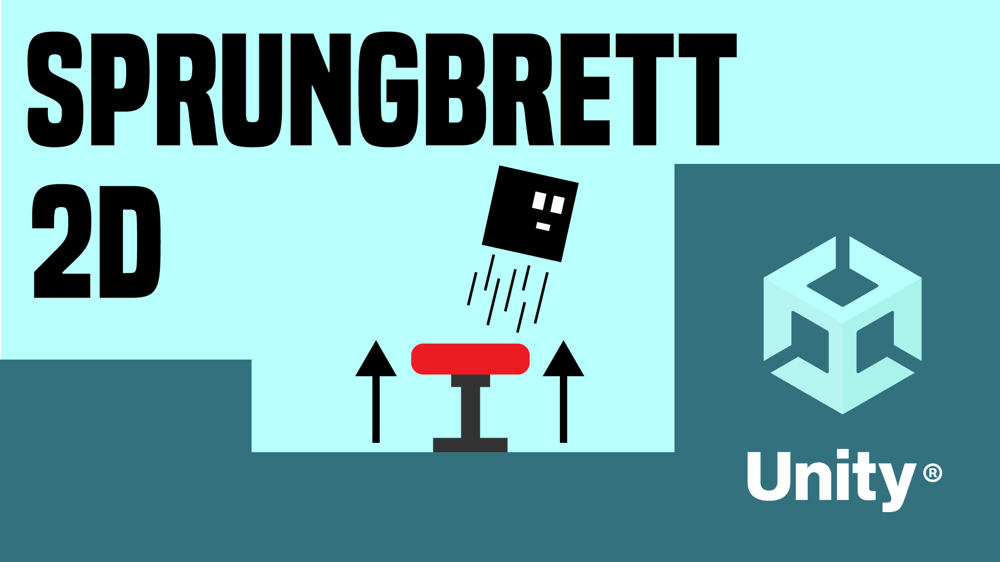

# Sprungbrett in Unity 2D

in diesem Video lernst du, ein Sprungbrett (Jumppad) in dein 2D Spiel einbauen kannst. 

- [🎬 YT Tutorial](https://youtu.be/HvNfckbzybo)
- [💬 Joint unserem Discord Server](https://discord.gg/cY5RW7D95u)
- [👍 Abonniert um keine Videos zu verpassen](https://www.youtube.com/@prezipgames)

## Viel Spaß beim Entwickeln!
